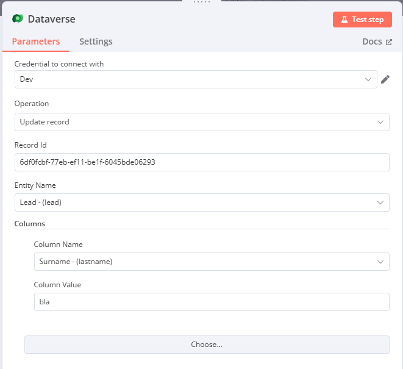
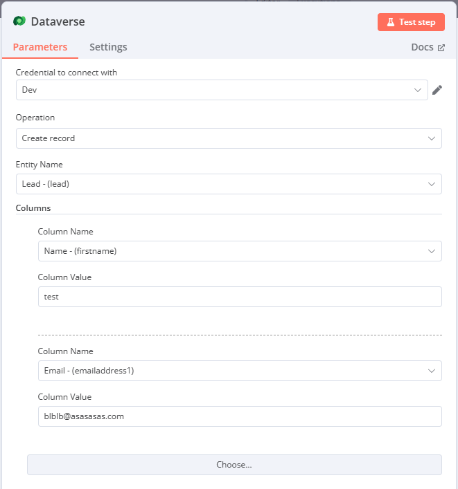

# Dataverse n8n Custom Node

This n8n custom node enables seamless integration with the Dynamics 365 Dataverse API, empowering you to automate Dataverse interactions within your n8n workflows.

## Features

*   **Authentication:** Utilizes OAuth 2.0 Client Credentials for secure access to Dataverse.
*   **Data Retrieval:** Supports FetchXML and OData queries for flexible data retrieval.
*   **Record Manipulation:** Enables creating, updating, and deleting records.
*   **Metadata Access:** Provides functionality to retrieve entity and attribute metadata, including option set values.
*   **Dynamic Options:** Dynamically loads entity and attribute options within the n8n interface for a user-friendly experience.

## What is Dataverse and How Can This Node Help?

Microsoft Dataverse is the underlying data platform for Dynamics 365 and Power Platform. It provides a structured way to store and manage data for business applications.  This n8n node acts as a bridge, allowing you to connect your n8n workflows directly to your Dataverse instance.  This opens up a wide range of automation possibilities:

*   **Data Synchronization:** Automatically synchronize data between Dataverse and other systems (e.g., CRMs, databases, marketing platforms).
*   **Workflow Automation:** Trigger actions in Dataverse based on events in other systems, or vice-versa.  For example, create a new contact in Dataverse when a new lead is submitted through a web form.
*   **Data Transformation:** Transform and enrich data before it's stored in Dataverse.
*   **Reporting and Analytics:** Retrieve data from Dataverse and use it to generate reports or dashboards.
*   **Integration with Power Platform:** Connect your n8n workflows to Power Apps, Power Automate, and Power BI.

## Where to Find the Necessary Information

To use this node effectively, you'll need the following information from your Azure Active Directory and Dataverse environment:

*   **Tenant ID:**  Found in the Azure portal under your Azure Active Directory properties.
*   **Client ID:** Obtained when registering your application in Azure AD.
*   **Client Secret:** Generated for your application in Azure AD.  *(Treat this as a password and store it securely.)*
*   **Scope:** The URL of your Dataverse environment (e.g., `https://<your-org-name>.crm4.dynamics.com`).  You can find this in your Dynamics 365 settings.
*   **Entity Logical Names:**  These are the internal names for entities (tables) in Dataverse (e.g., `account`, `contact`).  You can find these in the Dataverse metadata or by inspecting the entity in Dynamics 365.
*   **Attribute Logical Names:** These are the internal names for attributes (columns/fields) within entities.  You can find these in the Dataverse metadata or by inspecting the entity in Dynamics 365.
*   **Record GUIDs:**  Globally Unique Identifiers are used to identify individual records in Dataverse.  You'll need these when updating or deleting specific records.  You can obtain these from Dataverse when retrieving records or from the URL of a record in Dynamics 365.

## Installation

**1. Install n8n (if you haven't already).  See the [n8n documentation](https://docs.n8n.io/) for installation instructions.**

This Dataverse n8n node is a community node and can be installed in a few ways, depending on how your n8n instance is set up.  Here are the general steps:

**2. Locate the Node:**

*   **n8n Community Nodes Repository:**  The most common way to install community nodes is through the n8n UI itself.  In your n8n instance, go to the "Nodes" section and search for "Dataverse".  If it's published in the community repository, you should find it there.

**3. Install the Node:**

*   **Using the n8n UI (Recommended):** If the node is available in the community repository, simply click the "Install" button.  n8n will handle the installation and dependencies. This is the simplest method.
*   **Manual Installation (for development or unpublished nodes):** If you're working with a development version of the node or if it's not yet published, you'll likely need to install it manually.  This usually involves:
    *   Cloning the repository (if you have the source code): `git clone https://github.com/TheunsBarnardt/CustomNodes.git`
    *   The Folder **n8n-nodes-custom-forms** is still in progress **don't try and install** 
    *   Navigating to the node's directory: `cd n8n-nodes-dataverse`
    *   Installing dependencies: `npm install` or `yarn install`
    *   Building the node: `npm run build`
    *   Linking the node (if necessary): `npm link`

    *   Restarting n8n.
*   **Install that package to n8n**
    *   `C:\Users\username\.n8n`
    *   `md custom` (if not exist)
    *   `cd custom`
    *   `npm init` (all defaults)
    *   `npm link n8n-nodes-dataverse`

**4.  Important Considerations:**

*   **n8n Version:**  Ensure your n8n version is compatible with the node. Check the node's documentation or repository for compatibility information.
*   **Dependencies:** The node might have dependencies that need to be installed.  The installation instructions should provide details about these.
*   **n8n Data Directory:**  Depending on your n8n setup, you might need to place the node files in the correct n8n data directory.  Consult the n8n documentation for the location of this directory.

## Authentication

1.  In n8n, navigate to **Credentials** and add a new "Dataverse Auth" credential.
2.  Fill in the following fields:

    *   **Authentication Method:** Select "Client Credentials".
    *   **Tenant ID:** Your Azure Active Directory tenant ID.  *(Obtain from Azure portal)*
    *   **Client ID:** Your application (client) ID. *(Obtain from Azure portal)*
    *   **Client Secret:** Your application's client secret. *(Obtain from Azure portal - keep secure!)*
    *   **Scope:** The URL of your Dataverse environment (e.g., `https://<your-org-name>.crm4.dynamics.com`).

## Node Operations and Parameters

The Dataverse node offers several operations, each with specific parameters:

### Get Data (GET)

*   **Type:** FetchXML or OData.
*   **Query:** The FetchXML or OData query string.

### Update Record (PATCH)

*   **Entity Name:** The logical name of the entity.
*   **Record ID:** The GUID of the record to update.
*   **Type:** Column.
*   **Columns (for COLUMN type):** Specify the columns and their new values.

### Create Record (POST)

*   **Entity Name:** The logical name of the entity.
*   **Type:** Column.
*   **Columns (for COLUMN type):** Specify the columns and their values.

### Get Lookup from Option Set Definitions (OPTIONSET)

*   **Entity Name:** The logical name of the entity the option set belongs to.
*   **Attribute Name:** The logical name of the attribute (field) using the option set.

### Get Lookup from Global Option Set Definitions (GLOBALOPTIONSET)

*   **Attribute Name:** The name of the global option set.

### Get Lookup from Entity (ENTITY)

*   **Entity Name:** The logical name of the entity.
*   **ID Column:** The logical name of the ID column.
*   **Name Column:** The logical name of the Name column.

## Dynamic Options

The node uses dynamic options loading for entity and attribute selection.  This means the available options are fetched directly from your Dataverse instance, ensuring you always have the latest information.

---

This documentation combines information from both provided sources and formats it for a GitHub README.  Remember to replace the placeholder image URLs with actual image files.  This improved structure and the addition of placeholders make the documentation more suitable for a GitHub repository.  You can further enhance it with specific usage examples, troubleshooting tips, and contribution guidelines.

